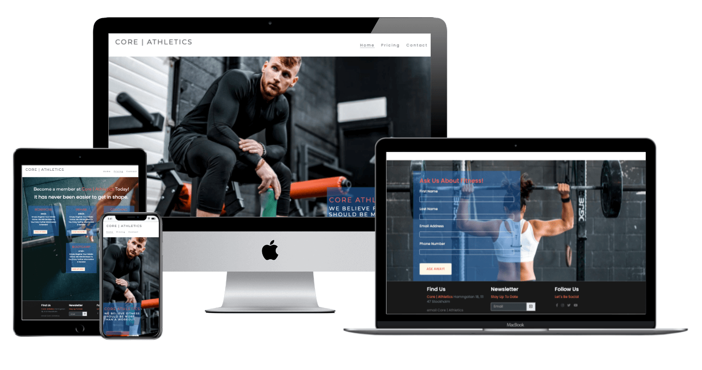
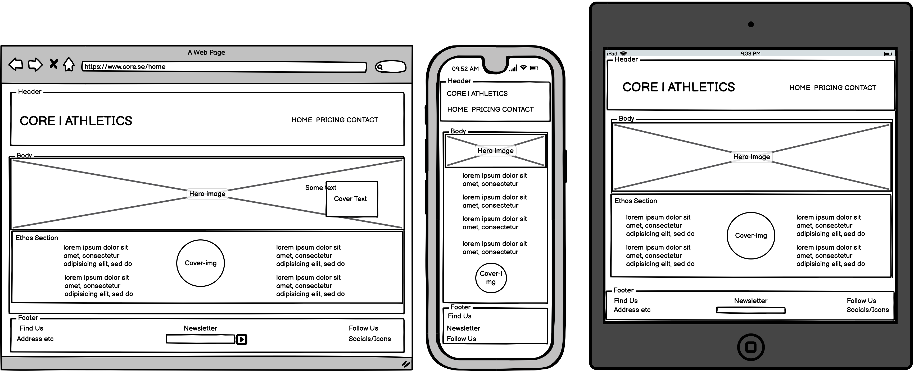
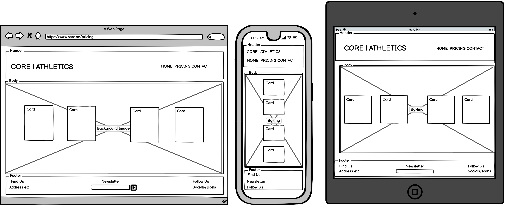
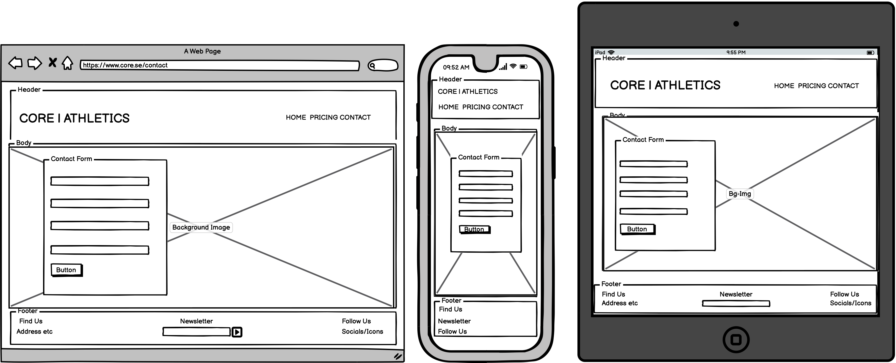
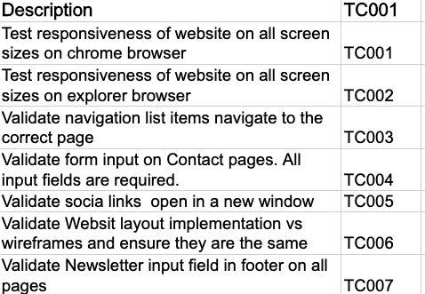
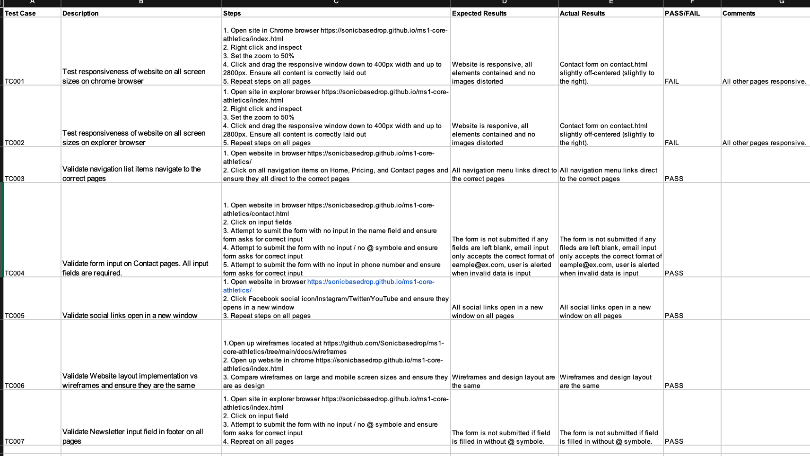

## Table of Content
----
* [Purpose](#Purpose)
* [User Experience Design (UX)](#User-Experience-Design)
  * [User stories](#User-Stories)
    * [First Time Visitor Goals](#First-Time-Visitor-Goals)
    * [Returning Visitor Goals](#Returning-Visitor-Goals)
    * [Frequent Visitor Goals](#Frequent-Visitor-Goals)
  * [Structure](#Structure)
  * [Design](#Design)
    * [Colour Scheme](#Colour-Scheme)
    * [Typography](#Typography)
    * [Imagery](#Imagery)
    * [Wireframes](#Wireframes)
  * [Limitations](#Limitations)
  * [Features](#Features)
  * [Features Left to Implement](#Features-Left-to-Implement)
* [Technologies](#Technologies)
* [Testing](#Testing)
  * [Summary](#Summary)
  * [High Level Test Cases](#High-Level-Test-Cases)
  *  [Out of Scope](#Out-of-Scope)
  * [Test Result](#Test-Results)

# Milestone 1

## Purpose
----
Purpose
This Website was created for the sole purpose of completing the first Milestone
Project for the Code Institute’s Full Stack Developer course. It was built using the
knowledge gained from the HTML, CSS and User Centric Design modules. A full
list of technologies used can be found in the technologies section of this
document.

A live version of website can be found [here](https://sonicbasedrop.github.io/ms1-core-athletics/index.html)

## Core Athletics (CA) Responsive Website

***
## User Experience Design
----

### User Stories
#### First Time Visitor Goals
 * As a First Time user, I want to easily understand the main purpose of
the site and learn more about CA and its services.
* As a First Time user, I want to be able to easily navigate throughout
the site to find content.
* As a First Time user, I want to view the website and content clearly on
mobile devices and tablets.
* As a First Time user, I want to find ways to follow Core Athletics on
different social media platforms.
* As a First Time use, I want to find contact information to the fitness center.

#### Returning Visitor Goals
* As a Returning user, I want to be able to contact the fitness center in order to enquire about personal trainer, rehab, bootcamp and other services. 
* As a Returning user, I want to get information about pricing of the fitness center´s various services.

#### Frequent Visitor Goals
*	As a Frequent user, I want to get information about new fitness classes, i.e. bootcamp activities etc. 
* As a Frequent user, I want to sign up to the Newsletter so that I am emailed about any major updates and/or changes to the website or the fitness centre.
*	As a Frequent user, I want to get informed of any new offers by the fitness centre.

#### Structure
All Pages will contain a Navigation menu at the top of the Webpage that directs them to a new Page to allow users to easily navigate the site. 

* As a First Time user, I want to be able to easily navigate throughout the site to find content.

The Home Page will contain appealing visuals and brief information of CA. The purpose of this is to fulfill user story:

*	As a First Time user, I want to easily understand the main purpose of the site and learn more about CA.

Custom CSS and/or Bootstrap will be used to make the Website responsive by the use of media queries and/or the Bootstrap Grid system.

All pages will be responsive and the layouts will change dependent on screen size. This is to ensure content flow is appealing, images are displayed properly and that the content is not shrunk side by side, so small that it is unreadable. The purpose of this is to fulfill user story:

* As a First Time user, I want to view the website and content clearly on my mobile device.

All pages will contain a Footer Element with contact information, a field to sign up for newsletters, and social media. The icons used will be from font-awesome. These are referenced below in the Frameworks-Libraries-and-Programs-Used section of this document. The aim of the Footer elements is to fulfill user stories:

*	As a First Time user, I want to find ways to follow CA on different social media platforms.
*	As a First Time user, I want to know where CA is located
*	As a Returning user, I want to contact CA so I can request more information

The Pricing Page will contain prices of CA’s various services. The purpose of this is to fulfill user stories:
*	As a First Time user, I want to get an overview of the price of CA’s services. 
*	As a Frequent user, I want to check for discounts and VIP offers. 

The Contact Page will contain a form that can be used to contact CA through the website. The purpose of this Page is to fulfill user stories:

*	As a Returning user, I want to contact CA so that I can request more information.
*	As a Frequent user, I want to sign up to the Newsletter so that I am emailed about any major updates and/or changes to the website or CA.

### Design

#### Colour Scheme
The four main colours used are Red, Black, Gray and White. 

#### Typography

The headers on all pages throughout the Website are using the Monserrat font, while the main text is using the Poppins font. Sans-serif is the fallback font in case for any reason the font isn’t being imported into the site correctly. 

#### Imagery
Imagery is important. Therefore, the hero and background images are chosen in order to catch the users’ attention and create a feel good atmosphere and sense of the aspiration towards a healthy, holistic life style that CA offers its clients. 

Images are provided by contributors to [Unsplash.](https://unsplash.com/) Photo credits are further detailed in the credit section.
#### Wireframes
Home page 
  
Pricing Page 
 
Contact Page 
 

For full Size PDF´s of wireframes click links below.
*  
*  
*  

* ### Limitations
Due to no JavaScript functionality, apart from Bootstraps, the contact forms will not store data or send email requests. This includes the newsletter input field.
---
# Features
---
## Existing Features
  * 	Newsletter input field on all pages. This allows users to sign up for CA’s latest updates.  
  * 	Bootstrap cards with information about CA services, with sign-up bottons.
  *  On contact page – contact form, for users to be able to get in touch with CA.
## Features Left to Implement
  * 	A Bootstrap calendar, in order for users to be kept up to date and schedule participation in C | A activities and fitness classes.
  *   In order to implement the calendar, sign-up and logins would have to be added, along with necessary backend resources.
  ---
  # Technologies
  ---
  ###	HTML
     * This project uses HTML as the main language used to complete the structure of the Website.
  ### CSS 
    	This project uses custom written CSS to style the Website.  
  ### [Bootstrap](https://getbootstrap.com/)
     * The Bootstrap framework is used throughout this website for layouts and styling. 
     * Bootstrap has also been used to create cards on conatct.html and the footer.
 ### [Fontawsome](https://fontawesome.com/)
  *  Fontawesome Icons are used for the Social media links contained in the Footer section of the website.
 ### [Google Fonts ](https://fonts.google.com/)   
   *  Google fonts are used throughout the project to import the Montserrat and Poppins fonts.
### [Gitpd](https://www.gitpod.io)
   *  Gitpod is the Integrated Development Environment used to develop the Website.
### [Github](https://github.com/)
   * GithHub is the hosting site used to store the source code for the Website and [Git Pages](https://pages.github.com/) is used for the deployment of the live site.
### [Git](https://git-scm.com/)
  *  Git is used as version control software to commit and push code to the GitHub repository where the source code is stored.
### [TinyJPG](https://tinypng.com/)
  *  TinyJPG is used to reduce the file sizes of images before being deployed to reduce storage and bandwidth.
### [Google Chrome Developer Tools](https://developer.chrome.com/docs/devtools/)
   * Google chromes built in developer tools are used to inspect page elements and help debug issues with the site layout and test different CSS styles.
### [Balsamiq Wireframes](https://balsamiq.com/)
  *  This was used to create wireframes for 'The Skeleton Plane' stage of UX design.
### [Favicon](https://favicon.io/)
   *  Favicon.io was used to make the site favicon
### [Techsini](https://techsini.com/multi-mockup/index.php)
   * tecnisih.com Multi Device Website Mockup Generator was used to create the Mockup image in this README.md
    ---
##  Testing
---
### Test Strategy
#### Summary

  * Testing is required on Milestone Project 1 – Core Athletics Responsive Website.

  * As this project is static and contains no back-end functionality, the testing performed will be on the visual effects and layout of the Website. Testing to be done on at least three    web browsers and all screen sizes.

  * No elements should overlap another container div. All elements should remain on the screen at all sizes above 300px. 

  * All nav links should direct to the correct html pages as per their names. The Home page is the exception, this one will redirect to index.html.

  * All links to external websites must open in a new browser.

  * Testing of form validation will also be required to ensure the correct inputs are taken and that all fields are required.

  * Validation of inclusion for all features included in the Structure of the Website / Wireframes must be performed.

  * The live Project can be found [here](https://sonicbasedrop.github.io/ms1-core-athletics/index.html)

  #### High Level Test Cases
      
#### Out of Scope
     * Testing form validation for phone number is out of scope. No regexp has been implemented. 

#### Test Results
  

   * All Pages were run through the W3C HTML Validator and showed?
     CSS Stylesheet was run through the W3C CSS Validator and showed no errors

    

        
     
