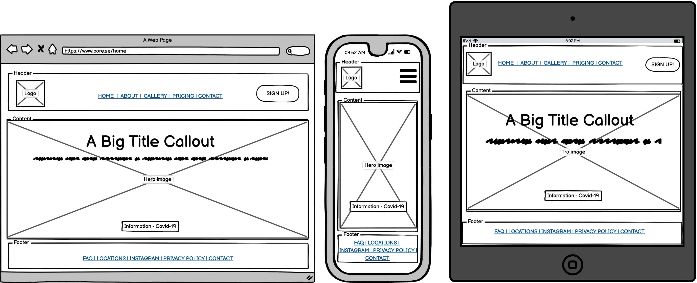
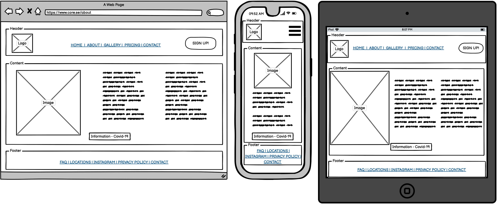
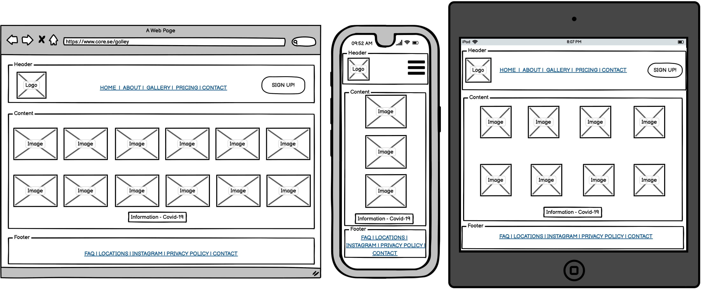
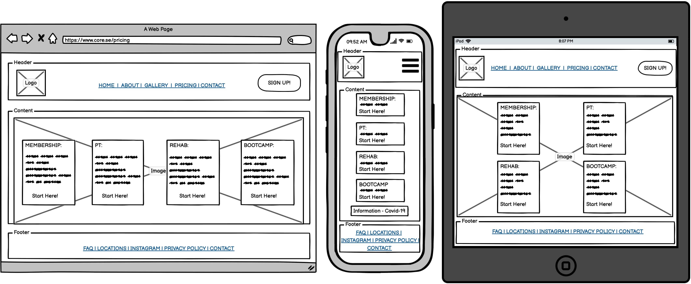
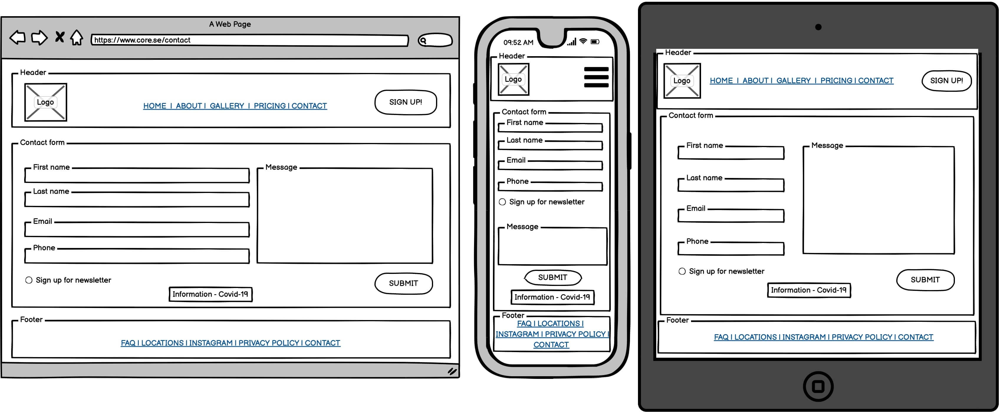

## Table of Content
----
* [Purpose](#Purpose)
* [User Experience Design (UX)](#User-Experience-Design)
  * [User stories](#User-Stories)
    * [First Time Visitor Goals](#First-Time-Visitor-Goals)
    * [Returning Visitor Goals](#Returning-Visitor-Goals)
    * [Frequent Visitor Goals](#Frequent-Visitor-Goals)
  * [Structure](#Structure)
  * [Design](#Design)
    * [Colour Scheme](#Colour-Scheme)
    * [Typography](#Typography)
    * [Imagery](#Imagery)
    * [Wireframes](#Wireframes)

# Milestone 1

## Purpose
----
Purpose
This Website was created for the sole purpose of completing the first Milestone
Project for the Code Institute’s Full Stack Developer course. It was built using the
knowledge gained from the HTML, CSS and User Centric Design modules. A full
list of technologies used can be found in the technologies section of this
document.
Core Athletics (CA) Responsive Website

CA was built upon request by the founder of the Core Athletics Fitness Centre. 
The client wanted a fully responsive website that could be used
to advertise its services and showcase its facilities and expertise within the area of fitness. Ultimately, the client wants to attract new members, as well as retain and expand its client base.
***
## User Experience Design
----

### User Stories
#### First Time Visitor Goals
 * As a First Time user, I want to easily understand the main purpose of
the site and learn more about CA and its services.
* As a First Time user, I want to be able to easily navigate throughout
the site to find content.
* As a First Time user, I want to view the website and content clearly on
mobile devices and tablets.
* As a First Time user, I want to find ways to follow Core Athletics on
different social media platforms.
* As a First Time use, I want to find contact information to the fitness centre.

#### Returning Visitor Goals
* As a Returning user, I want to be able to book a personal trainer, rehab, bootcamp and other services. 
* As a Returning user, I want to contact the fitness centre so I can request more about the fitness centre’s services.

#### Frequent Visitor Goals
*	As a Frequent user, I want to get information about new fitness classes, i.e. bootcamp activities. 
* As a Frequent user, I want to check if there are any new photos from the fitness centre’s latest bootcamp activities. 
* As a Frequent user, I want to sign up to the Newsletter so that I am emailed any major updates and/or changes to the website or the fitness centre.
d.	As a Frequent user, I want to get informed of any new offers by the fitness centre.

#### Structure
All Pages will contain a Navigation menu at the top of the Webpage that directs them to a new Page to easily allow users to Navigate the site easily. The Navigation Menu will be collapsible on a Mobile device to make use of space on smaller devices. The purpose of this is to fulfill user story:

* As a First Time user, I want to be able to easily navigate throughout the site to find content.

The Home Page will contain appealing visuals and limited information of CA. The purpose of this is to fulfill user story:

*	As a First Time user, I want to easily understand the main purpose of the site and learn more about CA.

Custom CSS and/or Bootstrap will be used to make the Website responsive by the use of media queries and/or the Bootstrap Grid system.

All pages will be responsive and the layouts will change dependent on screen size. This is to ensure content flow is appealing, images are displayed properly and that the content is not shrunk side by side, so small that it is unreadable. All pages will also include information about how CA adheres to guidelines regarding Covid-19. The purpose of this is to fulfill user story:

* As a First Time user, I want to view the website and content clearly on my mobile device.
*	As a First Time user, I want to understand how CA adheres to guidelines regarding Covid-19.

All pages will contain a Footer Element with FAQ, locations, social media, privacy policy and contact information. The icons used will be from font-awesome. These are referenced below in the Frameworks-Libraries-and-Programs-Used section of this document. The aim of the Footer elements is to fulfill user stories:

*	As a First Time user, I want to find ways to follow CA on different social media platforms.
*	As a First Time user, I want to know where CA is located
*	As a First Time user, I want to get responses to my questions about CA (in FAQ)
*	As a Returning user, I want to contact CA so I can request more information

The About Page will contain a brief bio of CA. This page is to help implement user story:

*	As a First Time user, I want to easily understand the main purpose of the site and learn more about CA.

The Gallery Page will contain 8-12 images from various CA fitness activities. The purpose of these galleries are to fulfill user story:

*	As a Frequent user, I want to check to see if there are any new photos and media from CA activities.

The Pricing Page will contain prices of CA’s various services. The purpose of this is to fulfill user stories:
*	As a First Time user, I want to get an overview of the price of CA’s services.
*	As a Returning user, I want to be able to purchase selected services. 
*	As a Frequent user, I want to check for discounts and VIP offers. 

The Contact Page will contain a form that can be used to contact CA through the website. This will also contain a check box that will allow the user to sign up for CA’s newsletter in order to keep up to date with the fitness centre. The purpose of this Page is to fulfill user stories:

*	As a Returning user, I want to contact the organisation so I can request more information.
*	As a Frequent user, I want to sign up to the Newsletter so that I am emailed any major updates and/or changes to the website or CA.

### Design

#### Colour Scheme
The four main colours used are Black, Gray, White and Blue, as these are aligned with CA brand colours. 

#### Typography

The headers on all pages throughout the Website are using the Roboto font, while the main text is using the Lato font. Sans-serif is the fallback font in case for any reason the font isn’t being imported into the site correctly. 

#### Imagery
Imagery is important. Therefore, the many hero and background images are chosen in order to catch the users’ attention and create a feel good atmosphere and sense of the aspiration towards a health, holistic life style that CA offers its clients. 

Images have provided by CA and contributors to [Unsplash.](https://unsplash.com/) Photo credits are further detailed in the credit section.
#### Wireframes
Home page 
  
About Page 
 
Gallery Page 
 
Pricing Page 
 
Contact Page 
 

For full Size PDF´s of wireframes click links below.
* [Home Page Wireframe](assets/wireframes/home.pdf)

* [About Page Wireframe](assets/wireframes/about.pdf)

* [Gallery Page Wireframe](assets/wireframes/gallery.pdf)

* [Pricing Page Wireframe](assets/wireframes/pricing.pdf)

* [Contact Page Wireframe](assets/wireframes/contact.pdf)